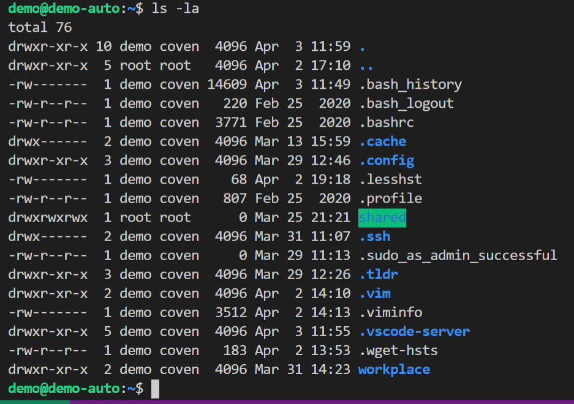

# 第三章：Linux服务器系统管理基础

## 1.实验环境：
* ubuntu 20.04.2 LTS as the guest OS
*  vscode remote-ssh
*  Oracle VM VirtualBox version 6.1.18 with Extension Pack installed

## 2.实验要求：
* 阅读阮一峰的「Systemd 入门教程：命令篇」与「Systemd 入门教程：实战篇」并进行动手实操。录屏上传到`asciinema`
* 完成课后自查清单

## 3.实验过程：
  
- **Systemd入门教程：命令篇**
  - [系统管理](https://asciinema.org/a/tB1gv22zmT6lzqLMbK4gDkgtC)
    
    - 运行失败命令：
    ```bash
    $ sudo timedatectl set-time YYYY-MM-DD
    $ sudo timedatectl set-time HH:MM:SS
    ```
    - 看了下[ubuntu manpages](http://manpages.ubuntu.com/manpages/bionic/man1/timedatectl.1.html)，没有看到可以这么用的命令。可能是阮一峰写时用的系统版本的不同。Ubuntu自定义设置时间还需要先关闭时间同步。

  - [Unit](https://asciinema.org/a/dkHLCWojSP964dve6fwci2cND) 
  	为了方便这里用的ssh.service做的演示。
    - 其中的某个命令：
        ```bash
        $ sudo systemctl set-property ssh.service CPUShares=500
        ```
    - 设置回原样命令：
        ```bash
        $ sudo systemctl set-property ssh.service CPUShares=
        ```
  - [Unit 的配置文件](https://asciinema.org/a/sJioKdrINlqqJIjRE28TKL2qy)
  - [Target](https://asciinema.org/a/ymGneoSu5Oh4FEVzAr1oRDcIM)
  - [日志管理](https://asciinema.org/a/7sEXm6Zv38jj5PCXRf2ThIsGa)
    - 失败命令
    ```bash
        $ journalctl --since 09:00 --until "1 hour ago"
    ```
    - 报错：`--since= must be before --until=`。
      - 最开始以为是命令输入错误，看了下[jornalctl手册](https://www.freedesktop.org/software/systemd/man/journalctl.html)。命令没有问题。用命令`timedatectl`看了下时区设置，发现时区有问题，更改时区为本地时区即可。

- **Systemd 入门教程：实战篇**
  - [Systemd-入门教程:实战篇-asciinema](https://asciinema.org/a/iKE3veRvxJHH7CLu2mkZd5Mwi)
   
    - ssh.service 服务字段分析 
      ```bash
        ● ssh.service - OpenBSD Secure Shell server
            Loaded: loaded (/lib/systemd/system/ssh.service; enabled; vendor preset: enabled)
            Drop-In: /etc/systemd/system.control/ssh.service.d
                    └─50-CPUShares.conf
            Active: active (running) since Thu 2021-04-01 20:01:20 CST; 1h 31min ago
            Docs: man:sshd(8)
                    man:sshd_config(5)
            Process: 47897 ExecStartPre=/usr/sbin/sshd -t (code=exited, status=0/SUCCESS)
            Main PID: 47899 (sshd)
            Tasks: 1 (limit: 2281)
            Memory: 1.1M
            CGroup: /system.slice/ssh.service
                    └─47899 sshd: /usr/sbin/sshd -D [listener] 0 of 10-100 startups

        Apr 01 20:01:20 demo-auto systemd[1]: Starting OpenBSD Secure Shell server...
        Apr 01 20:01:20 demo-auto sshd[47899]: Server listening on 0.0.0.0 port 22.
        Apr 01 20:01:20 demo-auto sshd[47899]: Server listening on :: port 22.
        Apr 01 20:01:20 demo-auto systemd[1]: Started OpenBSD Secure Shell server.
      ```
        Ⅰ `Loaded`行：ssh.service配置文件路径为`/lib/systemd/system/ssh.service`。`enable`:已经设置为开机自启动。`vender preset:enabled`:首次安装自动启动。
        Ⅱ `active`行： `active (running)`:service start,正在运行。
        Ⅲ `Docs:`: 该服务的文档地址。这里输入`man 8 sshd`即可查看。
        Ⅳ `Process`: 这里表示可能被`ExecStartPre`启动。
        Ⅴ `Min PID`: 主进程ID。被`ExecStart=`options。
        Ⅵ `Tasks`: 
        Ⅶ `CGroup:`： 应用的所有子进程
        Ⅷ 日志块：应用的日志
      
    - `ssh.service` 配置文件分析:
		```bash
		$ systemctl cat sshd.service
		# /lib/systemd/system/ssh.service
		[Unit]
		Description=OpenBSD Secure Shell server
		Documentation=man:sshd(8) man:sshd_config(5)
		After=network.target auditd.service
		ConditionPathExists=!/etc/ssh/sshd_not_to_be_run

		[Service]
		EnvironmentFile=-/etc/default/ssh
		ExecStartPre=/usr/sbin/sshd -t
		ExecStart=/usr/sbin/sshd -D $SSHD_OPTS
		ExecReload=/usr/sbin/sshd -t
		ExecReload=/bin/kill -HUP $MAINPID
		KillMode=process
		Restart=on-failure
		RestartPreventExitStatus=255
		Type=notify
		RuntimeDirectory=sshd
		RuntimeDirectoryMode=0755

		[Install]
		WantedBy=multi-user.target
		Alias=sshd.service

		# /etc/systemd/system.control/ssh.service.d/50-CPUShares.conf
		# This is a drop-in unit file extension, created via "systemctl set-property"
		# or an equivalent operation. Do not edit.
		[Service]
		CPUShares=
		```
		*注：下述内容，阮一峰在其[日志](http://www.ruanyifeng.com/blog/2016/03/systemd-tutorial-part-two.html)中所描述的那些字段说明这里不再赘述主要说下没有列出的部分*
		1. Unit 区块：
			`ConditionPathExists=!/etc/ssh/sshd_not_to_be_run`:按照[systemctl手册:ConditionPathExists](https://www.freedesktop.org/software/systemd/man/systemd.unit.html)上的意思，路径条件判断，如果当不路径存在，unit启动。
		
		2. Service 区块：
			`RestartPreventExitStatus` : [systemctl 手册：RestartPreventExitStatus](https://www.freedesktop.org/software/systemd/man/systemd.service.html#:~:text=RestartPreventExitStatus%3D,restart%20setting%20configured%20with%20Restart%3D%20.)。当被主进程退出时，退出状态的定义，这里是255
			`RuntimeDirectoryMode` : [systemctl手册：RuntimeDirectoryMode](https://www.freedesktop.org/software/systemd/man/systemd.exec.html)。默认值0755。
			
			*做这一部分的时候有一个跟着博客上的失败命令：*
			```bash
			demo@demo-auto:~$ sudo systemctl isolate shutdown.target
			Failed to start shutdown.target: Operation refused, unit shutdown.target may be requested by dependency only (it is configured to refuse manual start/stop).
			See system logs and 'systemctl status shutdown.target' for details.
			```
			其实报错也说了，拒绝手动启动，只能间接启动。查了下，好像是为了安全来考虑。

		3. Install 区块：
			`Alias=sshd.service`：就是别名的意思。

  	- `multi-user.target` 配置文件:
  	```bash
  	# /lib/systemd/system/multi-user.target
  	#  SPDX-License-Identifier: LGPL-2.1+
  	#
  	#  This file is part of systemd.
  	#
  	#  systemd is free software; you can redistribute it and/or modify it
  	#  under the terms of the GNU Lesser General Public License as published by
  	#  the Free Software Foundation; either version 2.1 of the License, or
  	#  (at your option) any later version.

	[Unit]
	Description=Multi-User System
	Documentation=man:systemd.special(7)
	Requires=basic.target
	Conflicts=rescue.service rescue.target
	After=basic.target rescue.service rescue.target
	AllowIsolate=yes
	```
	日志中对这几个字段都有说明。

## 4. 自查清单：
###  如何添加一个用户并使其具备sudo执行程序的权限？

	1. 添加用户：`sudo adduser xxx`
	2. 将新添加的用户加入sudo组`sudo usermod -G sudo -a XXX`


### 如何将一个用户添加到一个用户组？
   `sudo usermod -a -G xxx group_name`

### 如何查看当前系统的分区表和文件系统详细信息？

1. `df -h`:`df`命令是用来查看文件系统磁盘空间使用量的。但df 命令只会列出已挂载的文件系统信息，但是对于没有挂载的文件系统是查看不到的。

	```bash
	demo@demo-auto:~$ df -h
	Filesystem                         Size  Used Avail Use% Mounted on
	udev                               951M     0  951M   0% /dev
	tmpfs                              199M  1.1M  198M   1% /run
	/dev/mapper/ubuntu--vg-ubuntu--lv   78G  5.2G   69G   8% /
	tmpfs                              994M     0  994M   0% /dev/shm
	tmpfs                              5.0M     0  5.0M   0% /run/lock
	tmpfs                              994M     0  994M   0% /sys/fs/cgroup
	/dev/sda2                          976M  199M  711M  22% /boot
	/dev/loop0                          56M   56M     0 100% /snap/core18/1997
	/dev/loop1                          70M   70M     0 100% /snap/lxd/19188
	/dev/loop2                          56M   56M     0 100% /snap/core18/1988
	/dev/loop3                          33M   33M     0 100% /snap/snapd/11402
	/dev/loop4                          32M   32M     0 100% /snap/snapd/10707
	/dev/loop5                          71M   71M     0 100% /snap/lxd/19647
	tmpfs                              199M     0  199M   0% /run/user/1000
	```

2. `lsblk`:`lsblk`命令是用来查看块设备的。可查看未挂载文件系统的分区。
    
	```bash
	$ lsblk
	NAME                      MAJ:MIN RM  SIZE RO TYPE MOUNTPOINT
	loop0                       7:0    0 55.5M  1 loop /snap/core18/1997
	loop1                       7:1    0 69.9M  1 loop /snap/lxd/19188
	loop2                       7:2    0 55.5M  1 loop /snap/core18/1988
	loop3                       7:3    0 32.3M  1 loop /snap/snapd/11402
	loop4                       7:4    0 31.1M  1 loop /snap/snapd/10707
	loop5                       7:5    0 70.4M  1 loop /snap/lxd/19647
	sda                         8:0    0   80G  0 disk 
	├─sda1                      8:1    0    1M  0 part 
	├─sda2                      8:2    0    1G  0 part /boot
	└─sda3                      8:3    0   79G  0 part 
	└─ubuntu--vg-ubuntu--lv 253:0    0   79G  0 lvm  /
	sr0                        11:0    1 1024M  0 rom  
	sr1                        11:1    1 1024M  0 rom  	
	```	

3. `fdisk -l`:`fdisk`是一个用来格式化硬盘、分区等的分区表操纵工具，可以用来打印硬盘信息
	```bash
	Disk /dev/loop0: 55.46 MiB, 58142720 bytes, 113560 sectors
	Units: sectors of 1 * 512 = 512 bytes
	Sector size (logical/physical): 512 bytes / 512 bytes
	I/O size (minimum/optimal): 512 bytes / 512 bytes

	Disk /dev/loop1: 69.9 MiB, 73277440 bytes, 143120 sectors
	Units: sectors of 1 * 512 = 512 bytes
	Sector size (logical/physical): 512 bytes / 512 bytes
	I/O size (minimum/optimal): 512 bytes / 512 bytes

	Disk /dev/loop2: 55.48 MiB, 58159104 bytes, 113592 sectors
	Units: sectors of 1 * 512 = 512 bytes
	Sector size (logical/physical): 512 bytes / 512 bytes
	I/O size (minimum/optimal): 512 bytes / 512 bytes

	Disk /dev/loop3: 32.28 MiB, 33841152 bytes, 66096 sectors
	Units: sectors of 1 * 512 = 512 bytes
	Sector size (logical/physical): 512 bytes / 512 bytes
	I/O size (minimum/optimal): 512 bytes / 512 bytes

	Disk /dev/loop4: 31.9 MiB, 32600064 bytes, 63672 sectors
	Units: sectors of 1 * 512 = 512 bytes
	Sector size (logical/physical): 512 bytes / 512 bytes
	I/O size (minimum/optimal): 512 bytes / 512 bytes

	Disk /dev/loop5: 70.39 MiB, 73797632 bytes, 144136 sectors
	Units: sectors of 1 * 512 = 512 bytes
	Sector size (logical/physical): 512 bytes / 512 bytes
	I/O size (minimum/optimal): 512 bytes / 512 bytes

	Disk /dev/sda: 80 GiB, 85899345920 bytes, 167772160 sectors
	Disk model: VBOX HARDDISK   
	Units: sectors of 1 * 512 = 512 bytes
	Sector size (logical/physical): 512 bytes / 512 bytes
	I/O size (minimum/optimal): 512 bytes / 512 bytes
	Disklabel type: gpt
	Disk identifier: 4D12FD17-3E22-4415-8CD6-33962CA322FA

	Device       Start       End   Sectors Size Type
	/dev/sda1     2048      4095      2048   1M BIOS boot
	/dev/sda2     4096   2101247   2097152   1G Linux filesystem
	/dev/sda3  2101248 167770111 165668864  79G Linux filesystem

	Disk /dev/mapper/ubuntu--vg-ubuntu--lv: 78.102 GiB, 84821409792 bytes, 165666816 sectors
	Units: sectors of 1 * 512 = 512 bytes
	Sector size (logical/physical): 512 bytes / 512 bytes
	I/O size (minimum/optimal): 512 bytes / 512 bytes
	```
###  如何实现开机自动挂载Virtualbox的共享目录分区？
- 这里按照[Mounting VirtualBox shared folders on Ubuntu Server 18.04 LTS (Bionic Beaver)
](https://gist.github.com/estorgio/0c76e29c0439e683caca694f338d4003)中详细的操作说明实现的开机自动挂载。


#### 这里主要说下遇到的问题与注意事项：

* 在文中`Mount the shared folder from the host to your ~/shared directory`这一步输入命令：
	```bash
	sudo mount -t vboxsf shared ~/shared
	```
	一直报错找不到文件，最后发现是创建共享目录的时候文件命名不一致，改统一文件名即可。


* 如果不熟悉`nano`。用vim修改配置文件保存再退出也可。 

#### 挂载实验结果：



*可以看到共享文件夹被高亮*

### 基于LVM（逻辑分卷管理）的分区如何实现动态扩容和缩减容量？


1. 动态缩减：`lvresize --size -{{SIZE}} --resizefs {{volume_group}}/{{logical_volume}}`。

	执行命令前用`sudo lvdisplay `查看lv状态：
	```bash
	--- Logical volume ---
	LV Path                /dev/demo-vg/demo-lv-2
	LV Name                demo-lv-2
	VG Name                demo-vg
	LV UUID                AK9ePG-cDPz-Oe4C-hfJH-1DQY-mvB2-Di2phE
	LV Write Access        read/write
	LV Creation host, time demo-auto, 2021-04-02 22:56:00 +0800
	LV Status              available
	# open                 1
	LV Size                13.98 GiB
	Current LE             3579
	Segments               4
	Allocation             inherit
	Read ahead sectors     auto
	- currently set to     256
	Block device           253:2
	```
	这里执行`lvresize --size -5G --resizefs  /dev/demo-vg/demo-lv-2`
	结果：
	```bash
	LV Path                /dev/demo-vg/demo-lv-2
	LV Name                demo-lv-2
	VG Name                demo-vg
	LV UUID                AK9ePG-cDPz-Oe4C-hfJH-1DQY-mvB2-Di2phE
	LV Write Access        read/write
	LV Creation host, time demo-auto, 2021-04-02 22:56:00 +0800
	LV Status              available
	# open                 1
	LV Size                8.98 GiB
	Current LE             2299
	Segments               2
	Allocation             inherit
	Read ahead sectors     auto
	- currently set to     256
	Block device           253:22
	```
2. 动态扩容：`lvresize --size +{{SIZE}} --resizefs {{volume_group}}/{{logical_volume}}`

	执行之前lv状态
	```bash
	LV Path                /dev/demo-vg/demo-lv-2
	LV Name                demo-lv-2
	VG Name                demo-vg
	LV UUID                AK9ePG-cDPz-Oe4C-hfJH-1DQY-mvB2-Di2phE
	LV Write Access        read/write
	LV Creation host, time demo-auto, 2021-04-02 22:56:00 +0800
	LV Status              available
	# open                 1
	LV Size                8.98 GiB
	Current LE             2299
	Segments               2
	Allocation             inherit
	Read ahead sectors     auto
	- currently set to     256
	Block device           253:22
	```

	这里输入命令：`lvresize --size +5G --resizefs  /dev/demo-vg/demo-lv-2`。因为加了5G又变回去了，或者输入`lvresize -l +100%FREE  /dev/demo-vg/demo-lv-2`把剩余可用空间加进去。*在这里两者等价*

	执行结果：
	```bash
	LV Path                /dev/demo-vg/demo-lv-2
	LV Name                demo-lv-2
	VG Name                demo-vg
	LV UUID                AK9ePG-cDPz-Oe4C-hfJH-1DQY-mvB2-Di2phE
	LV Write Access        read/write
	LV Creation host, time demo-auto, 2021-04-02 22:56:00 +0800
	LV Status              available
	# open                 1
	LV Size                13.98 GiB
	Current LE             3579
	Segments               4
	Allocation             inherit
	Read ahead sectors     auto
	- currently set to     256
	Block device           253:22
	```

*可以对比看到 lv size 字段的变化*

###  如何通过systemd设置实现在网络连通时运行一个指定脚本，在网络断开时运行另一个脚本？

修改`systemd-networkd.service`配置文件
```bash
[Service]
...
ExecStart=<path_service1> start
ExecStop=<path_service2> stop
...
```

###  如何通过systemd设置实现一个脚本在任何情况下被杀死之后会立即重新启动？实现杀不死？
服务脚本配置：
```bash
[Service]
...
Restart=always
...
```

## 5.参考资料
* [CUCCS/linux-2020-ididChan homework03](https://github.com/CUCCS/linux-2020-ididChan/blob/homework03/homework03/About%20Systemd.md#4-%E8%87%AA%E6%9F%A5%E6%B8%85%E5%8D%95)
* [linux-2020-LyuLumos/ch0x03/report3](https://github.com/CUCCS/linux-2020-LyuLumos/blob/ch0x03/ch0x03/report3.md#%E8%87%AA%E6%9F%A5%E6%B8%85%E5%8D%95)
* [阮一峰的网络日志 Systemd 入门教程：命令篇](http://www.ruanyifeng.com/blog/2016/03/systemd-tutorial-commands.html)
* [阮一峰的网络日志 Systemd 入门教程：实战篇](http://www.ruanyifeng.com/blog/2016/03/systemd-tutorial-part-two.html)
* [ubuntu manpages timedatectl](http://manpages.ubuntu.com/manpages/focal/man1/timedatectl.1.html)
* [Mounting VirtualBox shared folders on Ubuntu Server 18.04 LTS (Bionic Beaver)](https://gist.github.com/estorgio/0c76e29c0439e683caca694f338d4003)
* [第三章：Linux服务器系统管理基础 课件](https://c4pr1c3.github.io/LinuxSysAdmin/chap0x03.md.html#/lvm-arch)
* [Linux 系统与网络管理(2021)教学视频](https://www.bilibili.com/video/BV1Hb4y1R7FE?p=60)
* [journalctl 手册](https://www.freedesktop.org/software/systemd/man/journalctl.html)
* [What is the difference between Process: and Main PID: in the output of systemctl status?](https://unix.stackexchange.com/questions/378019/what-is-the-difference-between-process-and-main-pid-in-the-output-of-systemctl)
* [Linux中查看硬盘信息](https://daemon369.github.io/linux/2018/01/06/01-get-disks-info-in-linux)
* [How do i change property values for a systemd service?](https://www.lightnetics.com/topic/17440/how-do-i-change-property-values-for-a-systemd-service)
* [Systemctl: find out which commands are applicable for a service](https://serverfault.com/questions/755174/systemctl-find-out-which-commands-are-applicable-for-a-service)
* [systemctl status shows vendor preset: disabled](https://unix.stackexchange.com/questions/468058/systemctl-status-shows-vendor-preset-disabled#:~:text=If%20you%20see%20a%20Vendor,have%20to%20be%20manually%20started.)
* [systemd.unit — Unit configuration](https://www.freedesktop.org/software/systemd/man/systemd.unit.html)
